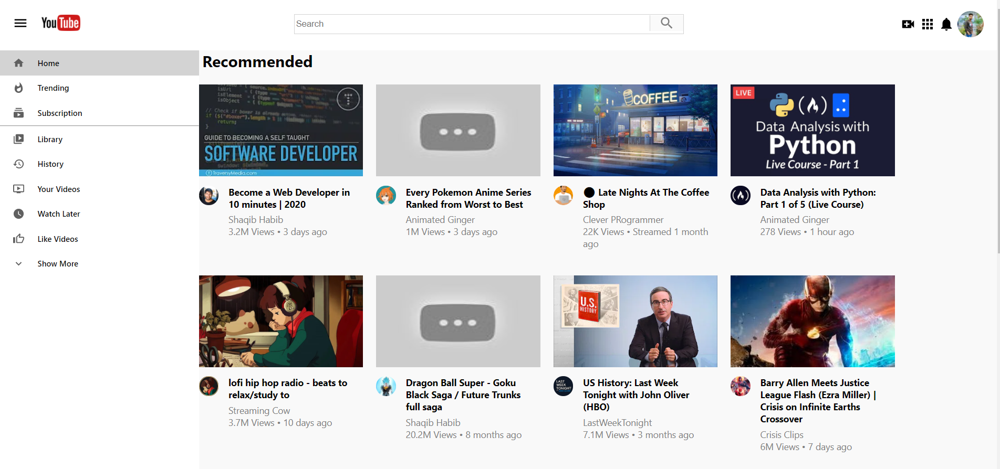

# Youtube Clone

A simple Youtube Clone made using React and Firebase.

## Demo

 
 

## Technologies used

- ReactJS, React Hooks, Firebase, Material UI

## Getting Started

- Fork and clone this repository
- Setup firebase and auth
- Run `yarn && yarn start` or `npm i && npm start`
